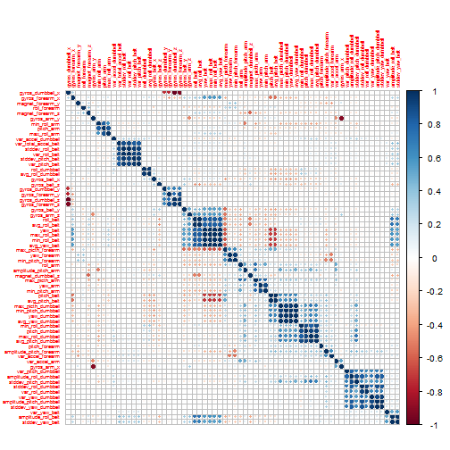

Weight Lifting Style Prediction
========================================================

# 1. Goal

Devices like accelerometers etc collect good amount of data, which can be used to measure the accuracy of human exercises. The goal of this exercise is to build a model to automatically predict the maaner in which humans do the exercise using the [training data](https://d396qusza40orc.cloudfront.net/predmachlearn/pml-training.csv). More details about the data can be found [here](http://groupware.les.inf.puc-rio.br/har).

# 2. Analysis

## 2.1 Data Preparation
- Load the required libraries, training and test data

```r
require(caret)
require(ggplot2)
require(corrplot)
require(randomForest)

set.seed(1234)
tr <- read.csv("pml-training.csv", header = TRUE)
origtest <- read.csv("pml-testing.csv", header = TRUE)
```

*Training and Test set has 19622 and 20 observations respectively over 160 predictors.*

- Divide the training set into training and crossvalidation set

```r
trindx <- createDataPartition(tr$classe, p = 0.7, list = FALSE)
training <- tr[trindx, ]
testing <- tr[-trindx, ]
```

*Observations in training and testing set are 13737 and 5885 respectively.*

- Remove the predictors with non-zero variance

```r
nzv <- nearZeroVar(training)
training <- training[-nzv]
testing <- testing[-nzv]
origtest <- origtest[-nzv]
```

* 56 predictors removed*

- Get only numeric features. All other integer and non-numeric features were ignored as they were causing miscalssification in the final model.

```r
num_features <- which(lapply(training, class) %in% c("numeric"))
```

*66 numeric predictors retained out of 104 predictors*

- As there are missing values in the data set, we would like to impute the missing values.

```r
imputemodel <- preProcess(training[, num_features], method = c("bagImpute"))
num_training <- predict(imputemodel, training[, num_features])
num_testing <- predict(imputemodel, testing[, num_features])
num_origtest <- predict(imputemodel, origtest[, num_features])
```


- Remove the highly correlated predictors(0.95).

```r
correlation <- cor(num_training)
highCorr <- findCorrelation(correlation, cutoff = 0.95)
# remove the highly correlated variables
training <- cbind(training$classe, num_training[, -highCorr])
testing <- cbind(testing$classe, num_testing[, -highCorr])
names(training)[1] <- "classe"
names(testing)[1] <- "classe"
origtest <- num_origtest[, -highCorr]
corrplot(correlation, , order = "hclust", tl.cex = 0.5)
```

 


Finally we have preprocessed data which is good for training the model.

## 2.2 Model Training

We will use the random forest method for training. Following are the steps involved:

- Train a random forest on the given data.

```r
fit <- randomForest(classe ~ ., training)
print(fit)
```

```
## 
## Call:
##  randomForest(formula = classe ~ ., data = training) 
##                Type of random forest: classification
##                      Number of trees: 500
## No. of variables tried at each split: 7
## 
##         OOB estimate of  error rate: 0.82%
## Confusion matrix:
##      A    B    C    D    E class.error
## A 3894    9    0    0    3    0.003072
## B   15 2625   15    0    3    0.012415
## C    1   18 2364    9    4    0.013356
## D    1    0   17 2232    2    0.008881
## E    0    4    6    5 2510    0.005941
```


# 3. Model Accuracy

We can measure the model accuracy using our training and cross-validation set. Training set accuracy will determine if we have high bias and cross-validation set will define if we have high variance.

## 3.1 In-Sample Accuracy


```r
tr_pred <- predict(fit, training)
print(confusionMatrix(tr_pred, training$classe))
```

```
## Confusion Matrix and Statistics
## 
##           Reference
## Prediction    A    B    C    D    E
##          A 3906    0    0    0    0
##          B    0 2658    0    0    0
##          C    0    0 2396    0    0
##          D    0    0    0 2252    0
##          E    0    0    0    0 2525
## 
## Overall Statistics
##                                 
##                Accuracy : 1     
##                  95% CI : (1, 1)
##     No Information Rate : 0.284 
##     P-Value [Acc > NIR] : <2e-16
##                                 
##                   Kappa : 1     
##  Mcnemar's Test P-Value : NA    
## 
## Statistics by Class:
## 
##                      Class: A Class: B Class: C Class: D Class: E
## Sensitivity             1.000    1.000    1.000    1.000    1.000
## Specificity             1.000    1.000    1.000    1.000    1.000
## Pos Pred Value          1.000    1.000    1.000    1.000    1.000
## Neg Pred Value          1.000    1.000    1.000    1.000    1.000
## Prevalence              0.284    0.193    0.174    0.164    0.184
## Detection Rate          0.284    0.193    0.174    0.164    0.184
## Detection Prevalence    0.284    0.193    0.174    0.164    0.184
## Balanced Accuracy       1.000    1.000    1.000    1.000    1.000
```

- The in-sample accuracy is 100% which indicates that model does not suffer from bias

## 3.1 Out-of-Sample Accuracy

```r
ts_pred <- predict(fit, testing)
print(confusionMatrix(ts_pred, testing$classe))
```

```
## Confusion Matrix and Statistics
## 
##           Reference
## Prediction    A    B    C    D    E
##          A 1672    8    0    0    0
##          B    0 1122    4    0    0
##          C    1    4 1015    5    3
##          D    0    2    6  957    2
##          E    1    3    1    2 1077
## 
## Overall Statistics
##                                        
##                Accuracy : 0.993        
##                  95% CI : (0.99, 0.995)
##     No Information Rate : 0.284        
##     P-Value [Acc > NIR] : <2e-16       
##                                        
##                   Kappa : 0.991        
##  Mcnemar's Test P-Value : NA           
## 
## Statistics by Class:
## 
##                      Class: A Class: B Class: C Class: D Class: E
## Sensitivity             0.999    0.985    0.989    0.993    0.995
## Specificity             0.998    0.999    0.997    0.998    0.999
## Pos Pred Value          0.995    0.996    0.987    0.990    0.994
## Neg Pred Value          1.000    0.996    0.998    0.999    0.999
## Prevalence              0.284    0.194    0.174    0.164    0.184
## Detection Rate          0.284    0.191    0.172    0.163    0.183
## Detection Prevalence    0.285    0.191    0.175    0.164    0.184
## Balanced Accuracy       0.998    0.992    0.993    0.995    0.997
```

- The Out-of-sample accuracy is greater than 99%, which should be sufficient for predicting the blind set of 20 observations.

# 4. Test set prediction

Applying the trained model on the test data, here are the predictions from the model


```r
answers <- predict(fit, origtest)
answers
```

```
##  1  2  3  4  5  6  7  8  9 10 11 12 13 14 15 16 17 18 19 20 
##  B  A  B  A  A  E  D  B  A  A  B  C  B  A  E  E  A  B  B  B 
## Levels: A B C D E
```


# 5. Conclusion
We are able to provide very good prediction of weight lifting style as measured with accelerometers.
